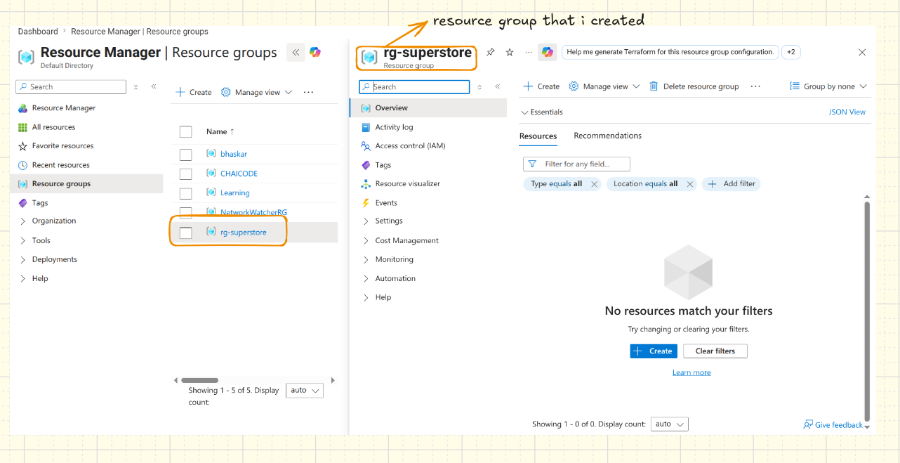
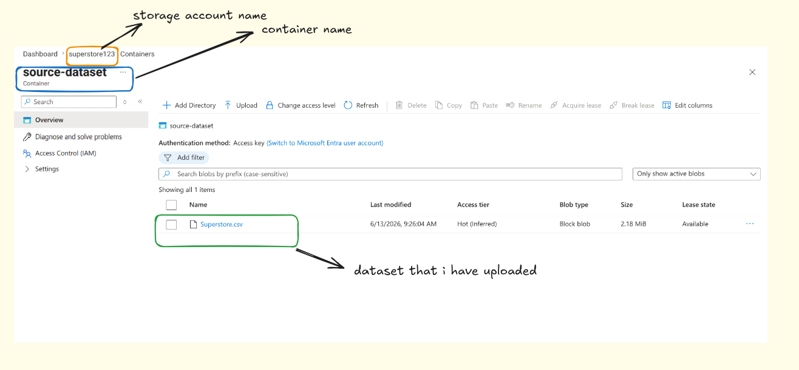
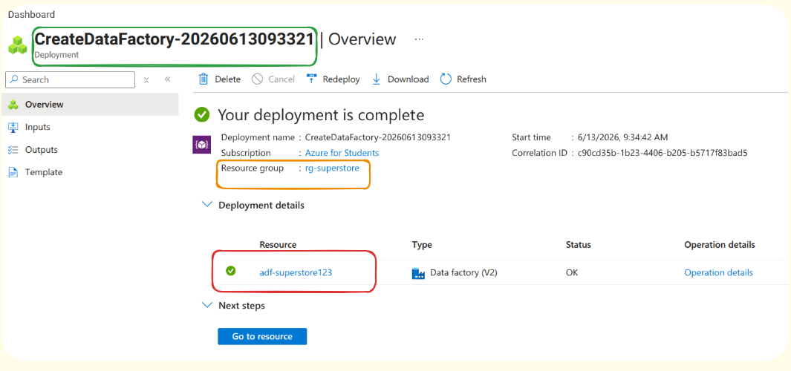
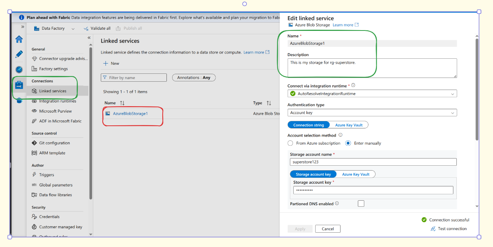
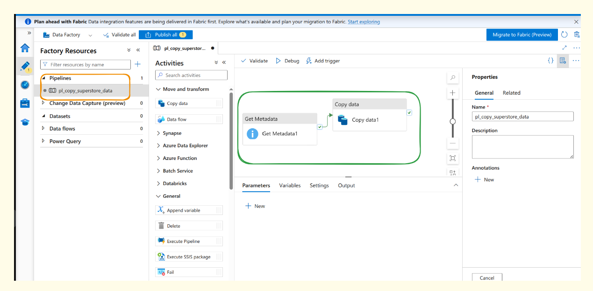
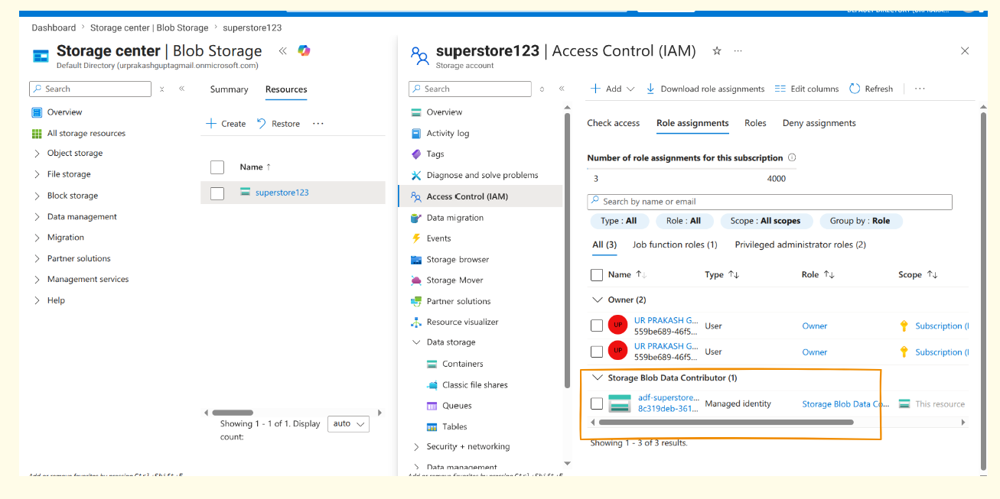
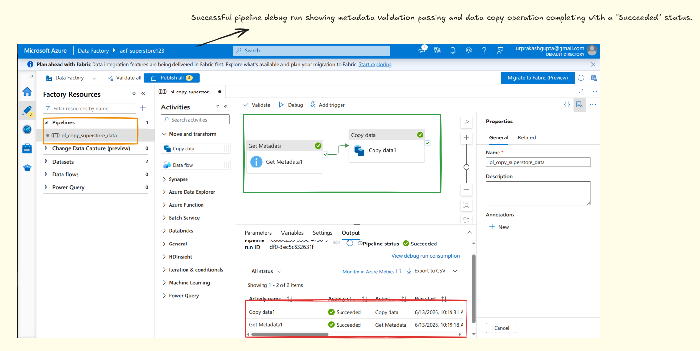

# End-to-End Azure Data Engineering Pipeline

## Project Objective

The goal of this project is to understand fundamental Microsoft Azure cloud concepts and build a robust, secure, and fully automated end-to-end data ingestion pipeline using **Azure Blob Storage** and **Azure Data Factory (ADF)**. The pipeline incorporates industry-standard enterprise data engineering patterns, including explicit Role-Based Access Control (RBAC) security and dynamic data control validation using a file-existence metadata check before executing data transfers.

---

## Technical Architecture Flow

`Blob Storage (Source Container)` ──> `Get Metadata (Validation)` ──[On Success]──> `Copy Data Activity` ──> `Blob Storage (Destination Container)`

---

## Detailed Step-by-Step Implementation

### Phase 1: Infrastructure Provisioning & Setup

1. **Resource Group Creation:** Deployed a unified resource group named `rg-superstore` within the `Central India` region to act as the logical container for all cloud infrastructure assets.
2. **Storage Account Setup:** Provisioned a general-purpose v2 Azure Storage Account named `superstore123` configured with standard performance metrics and local redundancy.
3. **Data Ingestion:** Created two distinct storage containers under the Blob service layer:
   - `source-dataset`: Serves as the landing zone for incoming records. Uploaded the final Kaggle Superstore retail dataset (`Superstore.csv`).
   - `destination-dataset`: Established as the empty target sink folder for processed data outputs.

_Figure 1: Unified Resource Group architecture mapping active cloud resources in Central India._

_Figure 2: Production-ready Azure Storage account showing successful dataset ingestion inside target source containers._

---

### Phase 2: Orchestration Layer Configuration (ADF)

1. **Azure Data Factory Deployment:** Provisioned a serverless Data Factory instance named `adf-superstore123` to orchestrate multi-layered dataset activities.
2. **Linked Service Integration:** Established an authenticated connection abstraction layer (`AzureBlobStorage1`) pointing directly to the storage firewall.
3. **Dataset Boundaries:** Defined logical entities mapping explicitly to file pathways:
   - `ds_SourceCSV`: Configured with a delimited text schema pointing directly to `source-dataset/Superstore.csv` with first-row headers enabled.
   - `ds_DestinationCSV`: Points cleanly to the empty pathing bounds of `destination-dataset`.

_Figure 3: Fully operational Azure Data Factory Studio studio environment._

_Figure 4: Secure Linked Service integration layer verifying absolute infrastructure-to-storage channel binds._

---

### Phase 3: Control Flow Design & Metadata Validation

To avoid common production faults caused by empty files or missing files breaking batch schedules, the pipeline implements an explicit governance validation block:

1. **Get Metadata Activity:** Interrogates the source folder pathing at runtime. Under its settings, the field list parameter was appended with an explicit `Exists` argument checking parameter flags.
2. **Success Dependency Constraint:** The green conditional flow connector maps the `Get Metadata` block directly onto the next node. The execution sequence will freeze safely if a file missing state occurs.
3. **Copy Data Activity:** Configured to map fields and perform a highly optimized stream copy of blocks from the source dataset down to the destination container sink.

_Figure 5: Full visual control flow canvas demonstrating the functional Metadata-to-Copy logical bindings._

---

### Phase 4: Identity & Access Management (IAM / Security)

Following strict cloud security principles of least privilege, access keys were completely ignored in favor of non-shared environment secrets:

- **System-Assigned Managed Identity:** Enabled individual identity flags natively inside the control configuration settings for `adf-superstore123`.
- **RBAC Role Mapping:** Handled roles through Access Control settings on the `superstore123` storage side, granting the data factory explicit **Storage Blob Data Contributor** status. This guarantees secure data reading and writing without exposing cleartext credentials.

_Figure 6: Confirmed Access Control (IAM) role assignments assigning least-privilege contributor parameters directly to the ADF Managed Identity._

---

### Phase 5: Pipeline Execution & Monitoring Verification

1. **Pipeline Validation:** Executed a full structural workspace analysis via the `Validate All` framework tool, ensuring zero schema mismatch or configuration dependency gaps.
2. **Debug Execution Run:** Initiated real-time workflow debug triggers. The activities automatically passed through active states (`Queued` → `InProgress` → `Succeeded`).
3. **Verification Output:** Confirmed full metric passing marks, with data transferred seamlessly.

_Figure 7: Final execution output window proving complete operational success and validation parameter clearances._

---

## Key Takeaways Summary

- **Cloud Infrastructure Best Practices:** Gained real-world knowledge on setting up matching regional deployment resource buckets to minimize latency and data transfer friction.
- **Resilient Data Pipelines:** Experienced the importance of metadata-driven engineering workflows by implementing gatekeeper constraints that prevent processing failures before execution.
- **Enterprise Security Architecture:** Mastered identity delegation through native Microsoft Entra ID managed tokens and granular IAM role mappings over weak static storage account keys.
