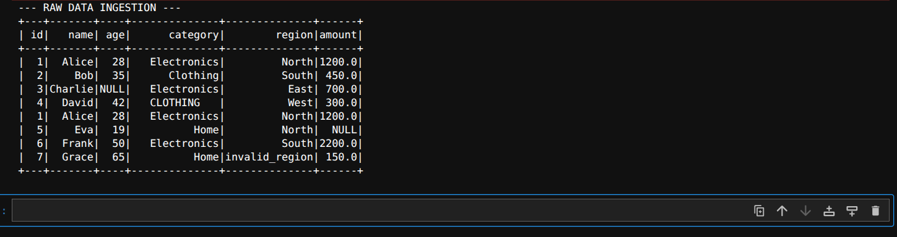
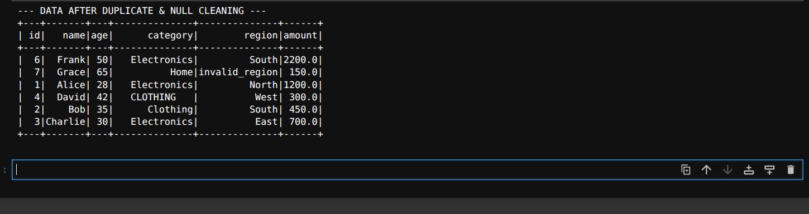
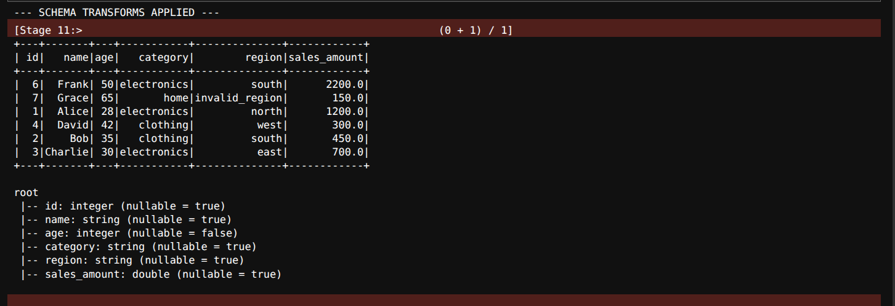
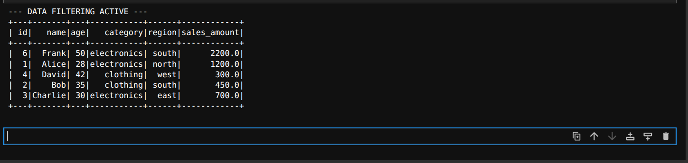
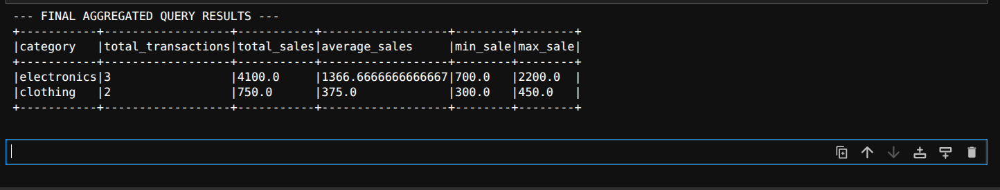

# Week 5: Apache Spark Fundamentals & Data Processing Pipeline

## 📌 Project Objective

The goal of this assignment is to master the fundamental mechanics of Apache Spark, explore distributed DataFrame transformations, and analyze a complete data cleaning and aggregation pipeline. This documentation demonstrates proof of data processing integrity by walking through each stage using visual console outputs.

---

## 🧠 Core Conceptual Takeaways

### 1. MapReduce Limitations vs. Apache Spark Advantages

- **Hadoop MapReduce Limitations:** MapReduce operates on rigid, multi-stage processing steps that strictly write intermediate operational results to physical hard disks ($I/O$ overhead). This structure introduces severe network serialization lags, making it highly inefficient for complex or multi-step workflows.
- **Apache Spark Advantages:** Spark relies heavily on **In-Memory Computing**. Intermediate data structures reside within cluster RAM across execution cycles, completely eliminating persistent physical disk writing loops. This yields operations up to 100x faster than legacy MapReduce systems.

### 2. Spark DataFrames and the Immutability Concept

- **Spark DataFrames:** Distributed collections of structured data organized into named columns, serving as an optimized equivalent to relational SQL tables.
- **Immutability Principle:** DataFrames cannot be altered in place once loaded into memory. Any applied modifications (like dropping nulls or casting) yield an entirely distinct DataFrame instance. This ensures rock-solid **Fault Tolerance**; if a cluster node crashes midway through complex execution loops, Spark instantly references its immutable structural lineage graph to recompute lost data states cleanly.

### 3. Wide vs. Narrow Transformations

- **Narrow Transformations:** Workflows where computations require data inside a single partition boundary exclusively (e.g., filtering a row or altering text casing). Data is processed completely locally without moving records across the network, requiring **zero network overhead**.
- **Wide Transformations (Shuffle Operations):** Heavy operations where data keys must be grouped globally across separate distributed cluster machines (e.g., executing a `groupBy` statement). This forces a **Shuffle Phase**, migrating massive byte payloads across network wires, which carries high network and computational resource costs.

---

## 🛠️ Step-by-Step Data Pipeline Stage Reports

Below is the step-by-step structural progression of our data engine pipeline, verified using console log snapshots:

### Step 1: Raw Data Ingestion

This stage confirms successful connection to our local source flat file. The initial ingestion snapshot captures the completely uncleaned state of the data, visibly highlighting duplicated transactions, missing fields (`NULL` data states), inconsistent whitespace padding, and lowercase/uppercase mixed structural boundaries.

---

### Step 2: Active Data Cleaning

This stage demonstrates our data scrubbing rules in action. Perfect redundant record states are identified and dropped across the cluster nodes. Missing age categories are assigned a baseline default median value, and incomplete records lacking non-negotiable metric tracking indicators are safely removed to prevent pipeline calculation skewing.

---

### Step 3: Schema Structural Transformation

This snapshot proves the schema alignment rules were successfully compiled by the Spark Catalyst engine. Categorical textual fields are completely stripped of messy spacing gaps and unified into lowercase characters to ensure proper grouping. String data types are formally cast into explicit numerical datatypes (`integer` and `double`) to guarantee mathematical calculation accuracy.

---

### Step 4: Targeted Narrow Row Filtering

This output validates our data isolation criteria using a narrow transformation. The console log confirms that entries fall within our precise demographic parameters, and outlier errors (such as corrupted regional data strings) are pruned from the operational dataset.

---

### Step 5: Wide GroupBy Aggregations & Query Results

The final processing phase triggers a wide shuffle transformation to aggregate rows across the remaining categories. This view highlights our multi-metric reporting calculations, computing complete category counts, sums, averages, minimum values, and maximum transaction limits simultaneously, finished off with a final post-aggregation threshold filter.

---

## 📂 Final Verification Output Export

Once all 5 visual stages complete successfully, the finalized analytical metrics table is converted and exported cleanly into your local filesystem directory at:

- `outputs/spark_assignment_final_metrics.csv`
